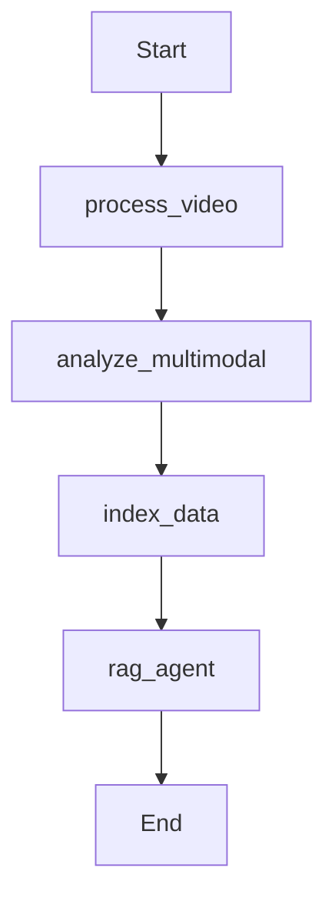

# YouTube Multimodal RAG Pipeline 🎬🤖

A production-grade multimodal Retrieval-Augmented Generation (RAG) system that processes YouTube videos using NVIDIA NIM services for transcription, vision analysis, and intelligent Q&A.

## ✨ Features

- 🎙️ **Audio Transcription**: NVIDIA Riva gRPC Whisper with word-level timestamps
- 👁️ **Vision Analysis**: Frame extraction and visual content understanding
- 🧠 **Hybrid RAG**: Combines vector search (semantic) + BM25 (keyword) retrieval
- ⚡ **Smart Chunking**: Automatic text splitting to handle embedding token limits
- 📊 **LangGraph Workflow**: Orchestrated multi-step processing pipeline
- 🎯 **Temporal Citations**: Answers include video timestamps

## 🎯 Example Usage

```python
# Ask questions about any YouTube video
url = "https://youtu.be/QDE6yoUTfgw"
question = "what is the collegium system?"

# Get AI-powered answers with timestamps
# Answer: "The Collegium system is... [11:30]"
```

## 🏗️ Architecture

```
User Query → Process Video → Analyze Multimodal → Index Data → RAG Agent → Answer
                 ↓                  ↓                  ↓            ↓
            (gRPC Whisper)    (Vision Model)    (Embeddings)  (LLM + Retrieval)
```

## 🚀 Quick Start

### Prerequisites

- Python 3.11+
- NVIDIA API Key ([Get one here](https://build.nvidia.com))
- `ffmpeg` installed on your system

### Installation

1. **Clone the repository**
```bash
git clone <your-repo-url>
cd YouTube-Multimodal-RAG-Pipeline
```

2. **Install dependencies**
```bash
pip install uv
uv sync
```

3. **Set up environment variables**
```bash
# Create .env file
echo "NVIDIA_API_KEY=your_nvidia_api_key" > .env
```

4. **Run the application**
```bash
uv run streamlit run app.py
```

## 📁 Project Structure

```
YouTube-Multimodal-RAG-Pipeline/
│
├── app.py                    # Streamlit UI
├── graph.py                  # LangGraph workflow
├── processor.py              # Video processing (Whisper, frames)
├── pyproject.toml            # Dependencies
├── visualize_graph.ipynb     # Workflow visualization
├── .env                      # API keys (not in git)
└── README.md                 # This file
```

## 🔧 Key Components

### 1. **NVIDIA gRPC Whisper Transcription**
- Direct gRPC protobuf implementation
- 100MB message size support
- Word-level timestamps
- High accuracy for long-form content

### 2. **Smart Embeddings Chunking**
- Automatic text splitting to 400 words (~512 tokens)
- Preserves timestamp metadata
- Handles combined audio + visual descriptions

### 3. **Hybrid RAG Retrieval**
- Vector search: Semantic similarity (top 5)
- BM25 search: Keyword matching (top 3)
- Combined context for better answers

### 4. **LangGraph Orchestration**


## 🎛️ Configuration

### NVIDIA NIM Models Used

| Component | Model | Purpose |
|-----------|-------|---------|
| Transcription | NVIDIA Riva ASR (Whisper) | Audio → Text with timestamps |
| Vision | Llama 3.2 11B Vision | Frame → Visual descriptions |
| Embeddings | `nvidia/nv-embedqa-e5-v5` | Text → Vector embeddings |
| LLM | `meta/llama-3.1-70b-instruct` | RAG answer generation |

### Adjustable Parameters

**In `processor.py`:**
- `interval_seconds=5`: Frame extraction frequency
- `sample_rate_hertz=16000`: Audio quality

**In `graph.py`:**
- `k=5`: Number of vector search results
- `n=3`: Number of BM25 results
- Chunk size: 10-second temporal windows

## 📊 Performance

- **20-minute video**: ~3-5 minutes processing
- **Transcription**: 42 segments with word-level timing
- **Frame extraction**: 252 frames at 5-second intervals
- **Embeddings**: 85 sub-chunks (from 42 original chunks)

## 🐛 Known Issues & Limitations

1. **Vision Model**: Currently uses fallback due to NVCF function-id availability
2. **Language Support**: English only for multimodal (Whisper supports 99+ languages)
3. **Video Length**: Tested up to 30 minutes; longer videos may require batching

## 🔜 Future Enhancements

- [ ] Add LLM-based answer verification (groundedness check)
- [ ] Support for live/streaming videos
- [ ] Local model option (Whisper + Ollama)
- [ ] Multi-language support for vision
- [ ] Batch processing for multiple videos

## 🤝 Contributing

Contributions are welcome! Please:
1. Fork the repository
2. Create a feature branch
3. Submit a pull request

## 📄 License

MIT License - See LICENSE file for details

## 🙏 Acknowledgments

- **NVIDIA NIM** for powerful AI models
- **LangChain** for RAG framework
- **LangGraph** for workflow orchestration
- **Streamlit** for UI

## 📞 Support

For issues or questions:
- Open a GitHub issue
- Check the [LangChain docs](https://python.langchain.com)
- Visit [NVIDIA NIM docs](https://build.nvidia.com)

---

**Built with ❤️ using NVIDIA NIM and LangChain**
